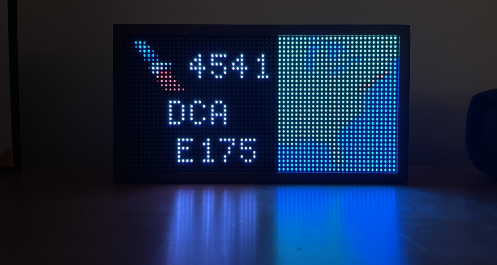

<h1>Tidbyt Airport Departure Tracker</h1>
<h3>Joshua Neronha, January 2021</h3>
 

</img>

<h2>Purpose</h2>

Tracking planes is fun, particularly at your home airport! My home airport is PVD, and I'm always curious about its activity. So when I received my <a href="tidbyt.com">Tidbyt</a> (a small, programmable 64 x 32 LED display), I figured I'd built a visualization that would show the next departure from PVD. Read on for details!

<h2>Methodology</h2>

There are two main components at work. The first is actually getting the flight data for the next flight out of PVD, and the second is generating this data as an image and pushing it to the device. Because these processes need to run continuously and I have a laptop, I bought a Raspberry Pi Zero for $12, installed Linux, and set up both of these tasks as cron jobs that run every few minutes. Similarly, because the Tidbyt can only pull data from web sources, I set up a cheap web server to host the data I pull.

<h4>Getting the Data</h4>

I couldn't find an API that reliably listed the departures for the airport of my choice (PVD), so I ended up using Python to just perform some web scraping with BeautifulSoup of PVD's departure board on their website. Not the best method, particularly for generalizability's sake, but it's better than the alternative of unreliable data. However, their website does not display aircraft models, so after finding the next flight from the departure board, I query a different API to get the aircraft model for the flight. I then generate a map of the route from latitude and longitude, and push all this information to my web server.

<h4>Generating Images</h4>

The idea here is to take the data generated using Python in the prior step for the next flight and then render it as an image to be pushed to the Tidbyt, which is done using generate.star. This is programmed in Starlark, a Python derivative with which the Tidbyt API is built. After laying out the data as shown in the image above, we simply push it to the Tidbyt!

<h2>Results, Discussion, and Challenges</h2>

The next departure from PVD, an AA flight to DCA on an Embrarer 175

 

This was the first project I did with my Tidbyt, and I am thrilled with the results! It's just fun to have this image effortlessly showing and updating around the house and is pretty much ideal for an aviation person like myself.

As the first project I did, there was definitely a learning curve learning how to use Starlark and properly render content on the Tidbyt. Also, I had never really used Linux or done any hardware projects before, so this was pretty fun and a great new experience.

I build on this project in my <a href="planerange.me">aircraf history tracker</a>, which shows the current location of all the planes I've been on in the past. While the project is distinct, there are a lot of shared resources and similarities, so this project was a great starting point for it!

<h2>Acknowledgments and Attribution</h2>

I release this project and all associated code into the public domain, and it may be used unrestricted as long as attribution is provided to this author and this project.
